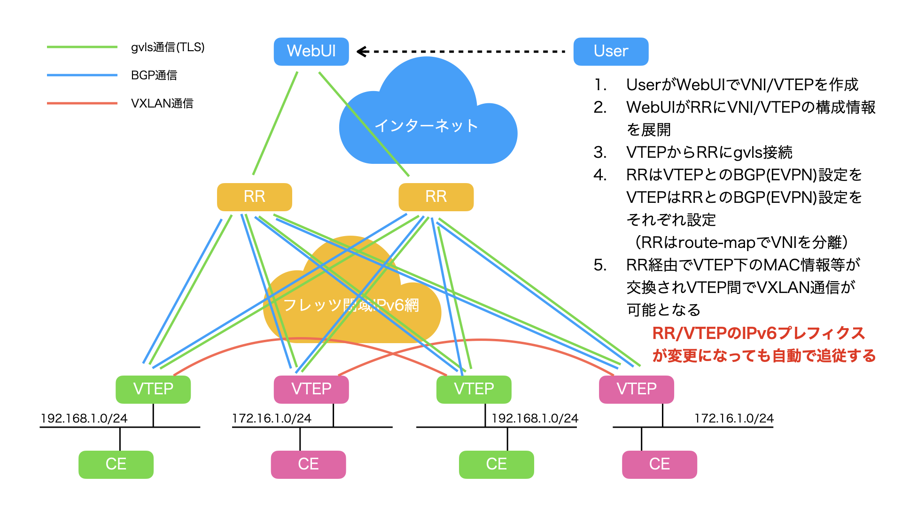

# 銀座堂仮想 LAN サービス

## 概要

銀座堂仮想 LAN サービス ( https://gvls.ginzado.ne.jp/ ) は EVPN/VXLAN による L2VPN をフレッツ閉域 IPv6 網で簡単に構築することができるサービスです。



このリポジトリでは銀座堂仮想 LAN サービスを構成するための以下のソフトウェアのソースコードをメンテナンスしています。

* `gvls-ui`
  * 銀座堂仮想 LAN サービスの設定を行うための Web UI を提供するソフトウェア
  * 管理者は一般利用者のアカウントを作成したり VNI/VTEP を作成したりできる
  * 一般利用者は VNI/VTEP を作成できる
  * `gvls-rr` からの接続を受け付け `gvls-rr` に対して VNI/VTEP の構成情報を提供する
* `gvls-rr`
  * BGP ルートリフレクタを構成するためのソフトウェア
  * `gvls-ui` へ接続し提供された VNI/VTEP の情報をもとに BGP ルートリフレクタの設定を行う
  * `gvls-vtep` からの接続を受け付け `gvls-vtep` に対して VTEP の構成情報を提供する
* `gvls-vtep`
  * BGP ルートリフレクタへの接続設定と隣接する VTEP の IPv6 アドレス一覧を構成するためのソフトウェア
  * `gvls-rr` へ接続し提供された VTEP の構成情報をもとに設定する

> [!NOTE]
> 単純に銀座堂仮想 LAN サービスを利用したいだけであれば必要となるソフトウェアは gvls-vtep のみです。
> それ以外は銀座堂仮想 LAN サービスと同等のサービスを構築したい時にのみ必要となります。
> もし銀座堂仮想 LAN サービスと同等のサービスを構築したいという方は [DEPLOY.md](DEPLOY.md) を参照してください。
> 以降では銀座堂仮想 LAN サービスを利用して VTEP を構成する方法のみ説明します。

## VTEP を構成するまでの流れ

> [!NOTE]
> 現時点で Ubuntu 24.04 LTS のみサポートしています。

### 銀座堂仮想 LAN サービスへの利用登録を行う

まだ銀座堂仮想 LAN サービスへの利用登録を行なっていないときは [Sign up](https://gvls.ginzado.ne.jp/signup) から利用登録します。

### 銀座堂仮想 LAN サービスにサインインする

[Sign in](https://gvls.ginzado.ne.jp/signin) から銀座堂仮想 LAN サービスにサインインします。

### VNI を作成する

[VNIs](https://gvls.ginzado.ne.jp/vnis) から VNI を作成します。

Create VNI の Description にその VNI の説明を適当に入力し「Create」ボタンを押します。

作成した VNI の番号は後で必要になるので控えておきます。

> [!NOTE]
> Free プランでは VNI を 1 個、 Pro プランでは 10 個、それぞれ作成することができます。

### VTEP を作成する

[VTEPs](https://gvls.ginzado.ne.jp/vteps) から VTEP を作成します。

Create VTEP の Description にその VTEP の説明を適当に入力し、VTEP password にその VTEP (`gvls-vtep`) が `gvls-rr` へ接続する際に認証するためのパスワードを入力し、「Create」ボタンを押します。

作成した VTEP の名前 (`gv000x` のような名前になっているはずです) は後で必要になるので控えておきます。

> [!WARNING]
> 現時点で VTEP password に入力したパスワードを忘れてしまった際に復旧する方法を用意していません。
> パスワードが分からなくなってしまった際は VTEP を削除してから新しい VTEP を作成し直す必要があるので、ここで設定したパスワードは忘れないように注意してください。

> [!NOTE]
> Free プランでは VTEP を 3 個、 Pro プランでは 30 個、それぞれ作成することができます。

### VTEP と VNI を紐づける

作成した VTEP で VNI を利用するためそれらを紐づけます。

[VNIs](https://gvls.ginzado.ne.jp/vnis) で VNI の VTEPs に表示された VTEP のチェックを入れ「Save」を押すか、
[VTEPs](https://gvls.ginzado.ne.jp/vteps) で VTEP の VNIs に表示された VNI のチェックを入れ「Save」を押すか、
いずれかの方法で紐づけることができます。

### VTEP に ipset をインストールする

`gvls-vtep` は `ipset` コマンドで VXLAN パケットを送ってき得る IPv6 アドレスを管理します。
`ipset` コマンドは標準インストールではインストールされていないのでインストールします。

```shell
$ sudo apt install ipset
```

### VTEP に zebra-rs をインストールする

[zebra-rs](https://zebra.rs/) を VTEP としたい Ubuntu にインストールします。
deb パッケージは [こちら](https://github.com/zebra-rs/zebra-rs/releases) で配布されています。

> [!NOTE]
> [ここ](https://www.ginzado.ne.jp/~m-asama/evpnvxlan6/) にある frr と frr-pythontools をインストールし、このあと説明する `/etc/default/gvls-vtep` で `GVLS_VTEP_OPTS="--bgp-backend frr"` を設定することで BGP 実装を zebra-rs から frr に切り替えることもできます。

### VTEP に `gvls-vtep` をインストールする

`gvls-vtep` の deb パッケージを VTEP としたい Ubuntu にインストールします。

### gvls-vtep の設定をする

`gvls-vtep` の設定は `/etc/default/gvls-vtep` を編集することで行います。

`/etc/default/gvls-vtep` は例えば以下のような内容になります。

```shell
GVLS_VTEP_NAME="gv0002"
GVLS_VTEP_PASS="password"
SRC_IFNAME="enp7s0"
RR1_HOST="gvls-rr1.i.open.ad.jp"
RR1_PORT="7102"
RR2_HOST="gvls-rr2.i.open.ad.jp"
RR2_PORT="7102"
GVLS_VTEP_OPTS="--vni 2:enp8s0"
```

`GVLS_VTEP_NAME` は VTEP の名前を設定します。この値は VTEP を作成した際に割り当てられたものです。

`GVLS_VTEP_PASS` は VTEP を作成した際に設定したパスワードを設定します。

`SRC_IFNAME` は EVPN/VXLAN の通信を行うインターフェース名を指定します。

`RR1_HOST` から `RR2_PORT` までは `gvls-rr` への接続先の設定ですが、これらはそのままで大丈夫です。

`GVLS_VTEP_OPTS` は VNI の設定を行うためのものです。この VTEP に割り当てたい VNI を `--vni (VNI 番号):(割り当てたいインターフェース名)` のように設定します。この設定は複数書くことが可能です。例えば VNI 2 を enp8s0 に、 VNI 3 を enp9s0 に、それぞれ設定したいような時は

```shell
GVLS_VTEP_OPTS="--vni 2:enp8s0 --vni 3:enp9s0"
```

のように設定します。

> [!NOTE]
> 但し、当然 `GVLS_VTEP_OPTS` に設定する VNI は [VTEPs](https://gvls.ginzado.ne.jp/vteps) でその VTEP に割り当てられた VNI である必要があります。

### `ip6tables` 等で VXLAN のパケットの受信を制限する (オプション)

VXLAN は全く関係ない IPv6 アドレスからのものでも VNI が一致した場合、受信してしまいます。

`gvls-vtep` は銀座堂仮想 LAN サービスで構成された VTEP の IPv6 アドレスを `gvls-neighs` という名前の `ipset` で構成します。

以下のような `ip6tables` ルールを設定することで銀座堂仮想 LAN サービスで構成されていない IPv6 アドレスからの VXLAN パケットを破棄するようになります。

```shell
*filter
:INPUT ACCEPT [0:0]
:FORWARD ACCEPT [0:0]
:OUTPUT ACCEPT [0:0]
-A INPUT -i enp7s0 -p udp -m udp --dport 4789 -m set --match-set gvls-neighs src -j ACCEPT
-A INPUT -i enp7s0 -p udp -m udp --dport 4789 -j DROP
COMMIT
```

### `gvls-vtep` の起動

設定が完了したら `gvls-vtep` を起動時に自動するよう構成し起動します。

```shell
$ sudo systemctl enable gvls-vtep
$ sudo systemctl start gvls-vtep
```

正常に構成できた場合、以下のようなログが出力されます。

```shell
$ sudo journalctl -u gvls-vtep -f
May 10 04:48:27 gvls-vtep1 systemd[1]: Started gvls-vtep.service - gvls-vtep.
May 10 04:48:27 gvls-vtep1 gvls-vtep[1359]: Initial local address selected on enp7s0: Some(2001:db8:d3a6:1800:5054:ff:fe12:20e3)
May 10 04:48:27 gvls-vtep1 gvls-vtep[1359]: Local address changed: None -> Some(2001:db8:d3a6:1800:5054:ff:fe12:20e3)
May 10 04:48:27 gvls-vtep1 gvls-vtep[1359]: Update VNI 2: local=Some(2001:db8:d3a6:1800:5054:ff:fe12:20e3)
May 10 04:48:27 gvls-vtep1 gvls-vtep[1359]: Update BGP neighbor gvls-rr1.i.open.ad.jp: local None->Some(2001:db8:d3a6:1800:5054:ff:fe12:20e3), remote None->None
May 10 04:48:27 gvls-vtep1 gvls-vtep[1359]: Update BGP neighbor gvls-rr2.i.open.ad.jp: local None->Some(2001:db8:d3a6:1800:5054:ff:fe12:20e3), remote None->None
May 10 04:48:33 gvls-vtep1 gvls-vtep[1359]: Starting RR connection attempt (gvls-rr1.i.open.ad.jp)
May 10 04:48:33 gvls-vtep1 gvls-vtep[1359]: Starting RR connection attempt (gvls-rr2.i.open.ad.jp)
May 10 04:48:33 gvls-vtep1 gvls-vtep[1359]: Sending RegisterVtepReq to RR (gvls-rr2.i.open.ad.jp)
May 10 04:48:33 gvls-vtep1 gvls-vtep[1359]: Sending RegisterVtepReq to RR (gvls-rr1.i.open.ad.jp)
May 10 04:48:33 gvls-vtep1 gvls-vtep[1359]: Sent RegisterVtepReq to RR (gvls-rr2.i.open.ad.jp)
May 10 04:48:33 gvls-vtep1 gvls-vtep[1359]: Receiving RegisterVtepRep from RR (gvls-rr2.i.open.ad.jp)
May 10 04:48:33 gvls-vtep1 gvls-vtep[1359]: Sent RegisterVtepReq to RR (gvls-rr1.i.open.ad.jp)
May 10 04:48:33 gvls-vtep1 gvls-vtep[1359]: Receiving RegisterVtepRep from RR (gvls-rr1.i.open.ad.jp)
May 10 04:48:33 gvls-vtep1 gvls-vtep[1359]: Received RegisterVtepRep from RR (gvls-rr1.i.open.ad.jp)
May 10 04:48:33 gvls-vtep1 gvls-vtep[1359]: Received RegisterVtepRep from RR (gvls-rr2.i.open.ad.jp)
May 10 04:48:33 gvls-vtep1 gvls-vtep[1359]: Registered to RR #1: neighs=1
May 10 04:48:33 gvls-vtep1 gvls-vtep[1359]: Sync neighbors: add=[2001:db8:d3a6:1800:5054:ff:fefa:3498] del=[]
May 10 04:48:33 gvls-vtep1 gvls-vtep[1359]: Sending hello gvls-rr1.i.open.ad.jp
May 10 04:48:33 gvls-vtep1 gvls-vtep[1359]: Sent hello gvls-rr1.i.open.ad.jp
May 10 04:48:33 gvls-vtep1 gvls-vtep[1359]: Received hello gvls-rr1.i.open.ad.jp
May 10 04:48:33 gvls-vtep1 gvls-vtep[1359]: RR #1 remote address changed: None -> Some(2001:db8:d3a6:1800:5054:ff:feff:11a0)
May 10 04:48:33 gvls-vtep1 gvls-vtep[1359]: Update BGP neighbor gvls-rr1.i.open.ad.jp: local Some(2001:db8:d3a6:1800:5054:ff:fe12:20e3)->Some(2001:db8:d3a6:1800:5054:ff:fe12:20e3), remote None->Some(2001:db8:d3a6:1800:5054:ff:feff:11a0)
May 10 04:48:33 gvls-vtep1 gvls-vtep[1359]: Registered to RR #2: neighs=1
May 10 04:48:33 gvls-vtep1 gvls-vtep[1359]: RR #2 remote address changed: None -> Some(2001:db8:d3a6:1800:5054:ff:fe11:88ba)
May 10 04:48:33 gvls-vtep1 gvls-vtep[1359]: Update BGP neighbor gvls-rr2.i.open.ad.jp: local Some(2001:db8:d3a6:1800:5054:ff:fe12:20e3)->Some(2001:db8:d3a6:1800:5054:ff:fe12:20e3), remote None->Some(2001:db8:d3a6:1800:5054:ff:fe11:88ba)
May 10 04:48:33 gvls-vtep1 gvls-vtep[1359]: Sending hello gvls-rr2.i.open.ad.jp
May 10 04:48:33 gvls-vtep1 gvls-vtep[1359]: Sent hello gvls-rr2.i.open.ad.jp
May 10 04:48:33 gvls-vtep1 gvls-vtep[1359]: Received hello gvls-rr2.i.open.ad.jp
```
